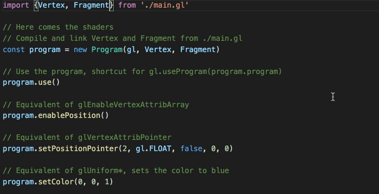

# glslx-loader
WebGL integration for Webpack and TypeScript




## Table of contents
- About
- Usage
- Known issues

### About

This project parses and type check GLSL code, then it generates JavaScript boilerplate code and TypeScript definitions.
This project uses [GLSLX](https://github.com/evanw/glslx) so you can conbine vertex and fragment shaders on the same file.

GLSL source :
```glsl
uniform mat4 transform;
uniform vec3 color;

attribute vec4 position;

export void Vertex() {
  gl_Position = transform * vec4(position.xy, 0, 1);
}

export void Fragment() {
  gl_FragColor = vec4(color, 1);
}

export void ColorFragment() {
  gl_FragColor = vec4(0, .5, 0, 1);
}
```

Generated TypeScript definition:
```ts
import {Shader} from 'glslx-loader/runtime/shader'

export class Vertex extends Shader {
	enablePosition(): void
	disablePosition(): void
	setPositionPointer(size: number, type: number, normalized: boolean, stride: number, offset: number): void
	setPosition(x: number, y: number, z: number, w: number): void

	setTransform(value: Float32Array|number[], transpose?: boolean): void
}

export class Fragment extends Shader {
	setColor(x: number, y: number, z: number): void
}

export class ColorFragment extends Shader {}

```

Generated JavaScript :
```js
import {Shader} from 'glslx-loader/runtime/shader'

export function Vertex(gl, type) {
    Shader.call(this, gl, type, Vertex.source)
}

Vertex.source = "precision mediump float;uniform mat4 c;attribute vec4 a;void main(){gl_Position=c*vec4(a.xy,0,1);}"
Vertex.attributes = [{
    name: "position",
    type: "vec4",
    symbol:"a"
}]
Vertex.uniforms = [{
    name: "transform",
    type:" mat4",
    symbol: "c"
}]

export function Fragment(gl, type) {
    Shader.call(this, gl, type, Fragment.source)
}

Fragment.source = "precision mediump float;uniform vec3 b;void main(){gl_FragColor=vec4(b.rgb,1);}"
Fragment.attributes = []
Fragment.uniforms = [{
    name: "color",
    type: "vec3",
    symbol: "b"
}]

export function ColorFragment(gl, type) {
    Shader.call(this, gl, type, ColorFragment.source)
}

ColorFragment.source = "precision mediump float;void main(){gl_FragColor=vec4(0,.5,0,1);}"
ColorFragment.attributes = []
ColorFragment.uniforms = []
```

### Usage

Just add `glslx-loader` for your files `webpack.config.js`, if your files end with `.gl`:
```js
{
    test: /\.gl$/,
    include: [
        path.resolve(__dirname, 'src')
    ],
    loader: 'glslx-loader'
}
```

### Known issues

- It does not work with `ts-loader` fork type checker plugin, it's not really an issue of `glslx-loader`
